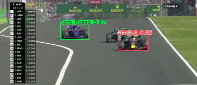
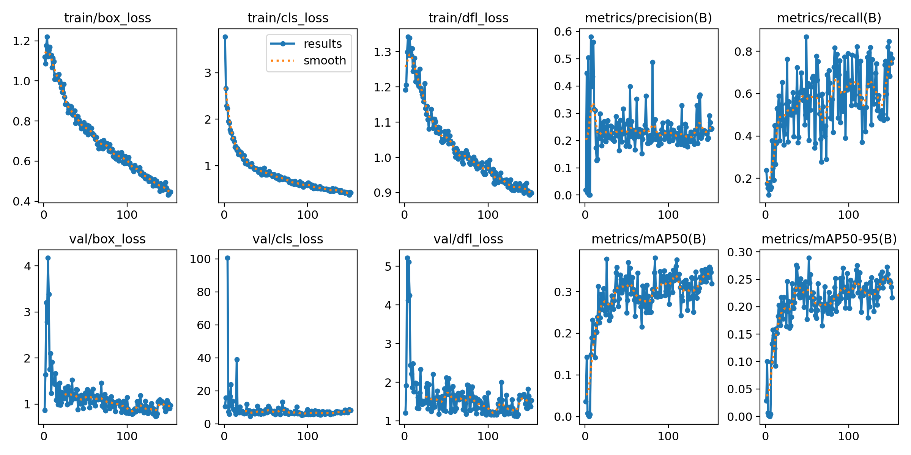
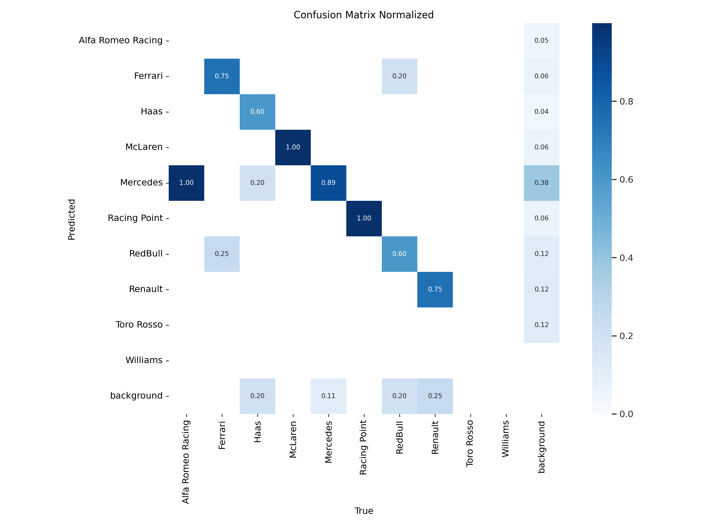
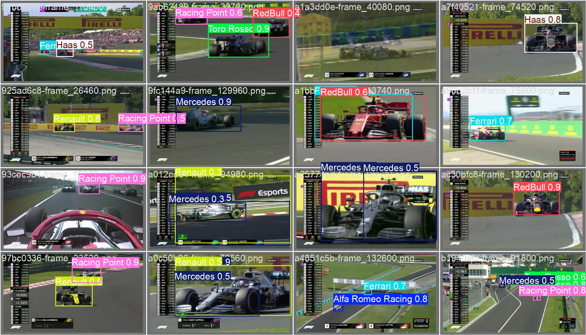

# 🏎️ FormulaTracker — Detect F1 cars by team with YOLO

> Train a YOLO model on a custom Formula 1 dataset to detect cars **by team** in video frames.

  

  <a href="https://www.kaggle.com/datasets/gazeux330000/formula1-box">Dataset on Kaggle</a> •
  <a href="https://docs.ultralytics.com/">Ultralytics YOLO docs</a> •

---

## Why this project?

TV overlays don’t always make it easy to follow who’s who at speed. FormulaTracker trains a YOLO model on a curated F1 broadcast to identify **which team** each car belongs to in every frame—unlocking analytics, overlays, and highlight tooling.

---

## Dataset

- **Source:** curated from a full Grand Prix broadcast. Non-relevant segments were trimmed out.
- **Annotation tool:** [labelImg](https://github.com/HumanSignal/labelImg)
- **Split:** `train = 442` images, `val = 111` images
- **Classes (10):**
  
1. Alfa Romeo Racing
2. Ferrari
3. Haas
4. McLaren
5. Mercedes
6. Racing Point
7. RedBull
8. Renault
9. Toro Rosso
10. Williams

# Train the model

| Hyperparameters | value      |
|-----------------|------------|
| task            | detect     |
| mode            | train      |
| model           | yolo11l.pt |
| epochs          | 200        |
| batch           | 16         |
| imgsz           | 640        |

### Results

  

### Confusion matrix

  

### Sample Predictions (validation batch)

  

# Roadmap / Future ideas
- 🚥 Real-time speed estimation: approximate car speeds using multi-frame tracking + homography.
- 📺 On-screen overlay: draw team labels on live or recorded video streams.
- 🧩 Tracking: integrate ByteTrack/BoT-SORT for consistent track IDs across frames.
- 🏁 More seasons: expand dataset with multiple races and lighting/weather conditions.

